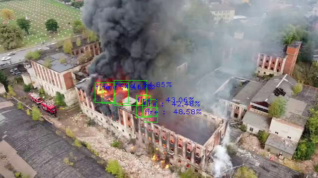
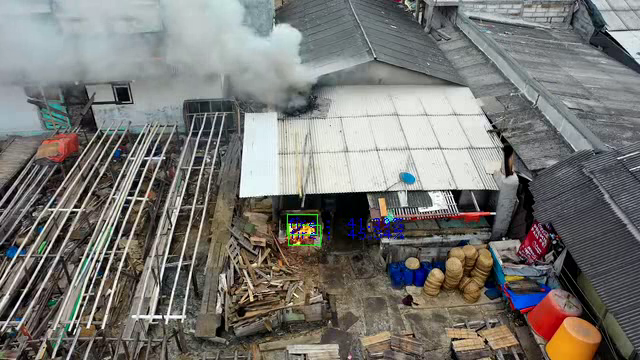
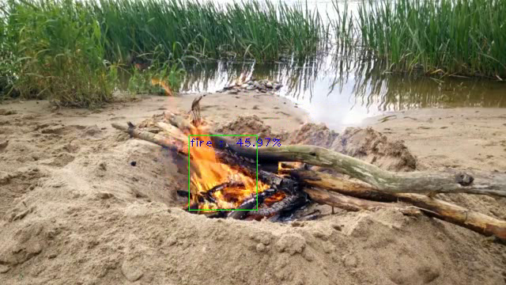

# Detecção de Fogo com rede YOLO v3 

Este projeto for realizado no contexto do curso Sensores Inteligentes para IoT da Formação IoT Specialist da [DIO](dio.me). O objetivo foi utilizar transfer learning para que uma rede YOLO v3 pré-treinada possa realizar a detecção de fogo a partir de imagens ou videos. Este projeto foi realizado na plataforma Google Colab a partir da biblioteca ImageAI e está disponibilizado no seguinte [notebook](Deteccao_fogo_yolo_v3.ipynb). 

